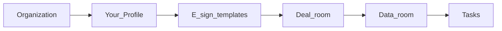

# Sponsor Guide

In-app copy lives alongside the product at `/help` (Sponsor Guide). This document mirrors that guide for offline review and repo search.

## Workflow

Recommended first-time setup order:

### Organization

Open **Settings** (`/settings`) and complete the **Organization** tab: workspace name and slug, organization contact, and billing entry as needed. Review the integrations note for environment-driven services.

### Your profile

In **Settings**, switch to **Your profile** and add display name, phone, title, and address fields used across the product.

### E-sign templates

Open **E-sign templates** (`/settings/esign`) from **System** in the sidebar or **E-Sign Templates** on **Settings** (`/settings`). The page groups **Library, subscription & questionnaire**—shared PDFs plus org-wide assignments for deals.

#### Who can change what

Most raise-team roles can create templates and edit PDFs/fields under **Your templates**. Choosing **Investor subscription packet** and **Investor questionnaire** is limited to members who may edit organization profile settings (typically founders/org admins). If those dropdowns are missing, ask someone with that access to set them.

#### Build the template library

Use **New template** to name a document (e.g. Mutual NDA, Subscription agreement), then expand the row and **upload a PDF**. Page through the preview, drag on the PDF to add field boxes, move and resize them, and set each field’s signer to **Sponsor** or **Investor**. **Auto-save:** the server updates shortly after you pause editing the template name or field layout (about one second); use **Save name & fields** for an immediate manual save. Expand **Merge field IDs** for auto-fill tokens (organization contact, signing user profile, investor name/email) on text or date fields. If upload fails, follow the toast—Firebase Storage and server credentials must allow the bucket write.

#### Investor subscription packet

Pick the library template used when an LP requests subscription documents on a **deal**; changes save on selection. Sponsor fields in the PDF produce a sponsor counter-sign step after the investor signs.

#### Investor questionnaire

Optional org-wide signable PDF (e.g. accreditation or suitability) for flows that use it.

#### Data rooms and NDAs

Data room **Settings** attach a **NDA / room access agreement** template from this library. Add the NDA PDF here first, then select it on the room and use **Send for signature (e-sign)** on the room when pushing an envelope to a specific investor.

#### Lifecycle

Each row shows a field count. **Delete** removes the template from the library and pickers; in-flight envelopes may still complete (see the in-app confirmation).

### Deal room

Create an offering (`/deals/new`), manage the list (`/deals`), and open a deal for the sponsor panel. Preview the investor-facing view from the deal when that option is available.

#### Analytics

Review page views, unique visitors, CRM interest count, open invites, commitment totals and average check, and CTA engagement as investors use the offering page.

#### Invite investors

Create deal-scoped or full-portal invites, copy links, optionally email recipients, set expiry, and note NDA expectations (enforce NDAs via linked data rooms). See **Invitations** in this guide for more.

#### Commitments

Track committed capital, participants, and document status for this deal.

#### Updates

Publish investor-facing posts (title and body) on the deal for invited investors—keep content factual and coordinated with counsel.

#### Settings

Configure narrative, media, CTAs, linked data rooms, booking links, and related options. **Complete every field you want investors to see**—empty fields change how complete and polished the deal looks to an LP. Empty subsections under **Why invest — investor narrative** are not shown to investors, so you can leave unused parts blank. **Traction metrics** (and the Traction block investors see) only appear after you add **at least one** metric; with none, that section stays hidden. Use paragraphs and bullet-style lines in longer text so the page is easy to read. Press **Save changes** when you are finished so edits apply.

### Data room

Open **Data room** (`/data-room`), create or select a room, and work through the tabs below. Associate the room with a deal in **Settings** when you need deal-scoped invites and NDA send lists tied to CRM **Interested deals**.

#### Investor view

Preview the room as an invited investor: welcome messaging, visible documents, and any NDA gate before files unlock.

#### NDA

Lists NDA envelopes for this room. Signing links appear in the table: open **Sponsor** or **Investor** to finish unsigned steps while links are active. When status is **Completed**, use **PDF** to download the fully signed agreement.

#### Documents

The toolbar shows **Bulk actions** next to **New folder**—use **New folder** at the current breadcrumb location, open folders to nest structure, and use **Move to…** from a file’s **⋯** menu to place items in nested folders. On upload, pick **Upload into folder** (room root or a folder) and set **Default upload type** (category such as Pitch Deck, Financial Model, or Legal). Use the category chips (**All**, **Financials**, **Legal**, **Pitch**, **Media**, **Hidden**) to filter by document type **across all folders**; use **Back to folder tree** to return to folder navigation. Each row’s **⋯** menu supports rename/move, investor visibility, preview/download, and delete.

#### Activity

Review opens, views by category, top documents, and a chronological feed for the room.

#### Investors

See invitations with access to this room (optionally narrowed by deal filter), including invite and NDA status. Open **⋯** on a row for actions such as resend, readmit, message, assign owner, or revoke when available.

#### Settings

Fill out room identity, **Associated deal**, description, visibility, and **NDA required before access**. Under **Electronic signatures (e-sign)**, select the **NDA / room access agreement (this room)** template from your library (manage templates in **Settings → E-sign**). Use **Send for signature (e-sign)** to push that template to a CRM investor who lists the linked deal under **Interested deals** (save room settings after linking a deal so eligible investors appear). Configure downloads, optional expiry, login requirements, and the **Welcome message**, then press **Save settings**.

### Tasks

Open **Tasks** (`/tasks`) as the execution center for follow-ups, closings, diligence, and other raise work.

#### Header (managers)

Use **New Task** to create work. **Bulk Actions** is reserved for a future multi-select flow (it currently shows a placeholder). **Automations** scrolls to the automation center at the bottom—the same shortcut appears in the workspace toolbar.

#### Metrics and suggestions

Metric cards cover **Open tasks**, **Due today**, **Overdue**, **Completed this week** (with a prior-week trend when available), **Investor follow ups**, and **Deal closing tasks**. Very large workspaces may show a cap note (~80 open/closed items loaded). **Smart suggestions** (when shown) highlight ideas from CRM, meetings, and tasks.

#### Workspace chips

**My Tasks** (your assignee), **Team Tasks** (open tasks for the org), **Investor Follow Ups** (CRM-style follow-up flag), **Deal Closings** (closing / send-docs / commitment-review types), **Completed** (history), plus **Automations** to jump to the rule list.

#### Views and filters

**List**, **Kanban**, **Calendar**, and **By owner**. **Kanban** and **By owner** apply to open work and are not used on **Completed**. **Calendar** combines open tasks with upcoming meetings. Search matches title, linked investor, or linked deal. Filter by **priority** (Critical through Low) and **owner** (including **Unassigned**).

#### Working a task

Open a row for the drawer: edit details, assignee, and links; jump to linked **Investor CRM** or **Deal room** records. From the list, mark done or reopen, snooze a week, or cancel.

#### Creating tasks

In **New task**, template chips (e.g. **Investor follow up**, **Closing checklist**, **Send docs**) prefill title and type. Add description, notes, due, reminder, priority, workflow status, assignee, and optional links to an investor, deal, or data room; optional repeat scheduling. Empty due dates use the dialog’s default horizon.

#### Task analytics and automations

**Task analytics** shows overdue share and open tasks by owner. **Automation center** lists triggers and actions (Live vs Preview) such as auto follow-ups after deal interest.

#### CRM link

CRM **next follow-up** on investors complements tasks so dates and follow-ups stay aligned.

## Investors & CRM

### Add investors

From **Investor CRM** (`/investors`), use **Add investor**, or open `/investors?add=1`.

### Import and export

Download the CSV template, fill rows, run **Import investors** to validate and commit, and export CSV for backups or external workflows.

### Views and filters

Use **Board**, **Table**, **Map**, **List**, and **Calendar** views with toolbar filters and saved presets. Open `/investors/[id]` for a full investor profile.

### Notes and interactions

Log notes and interactions and keep pipeline stages current; use bulk actions for stage changes at scale.

## Invitations

### Deal and portal invites

On a deal’s **Invite investors** tab, choose **This deal only** or **Full investor portal (all deals)**. Optionally email the recipient, set expiry, copy the link, and send when email is configured. Note NDA expectations on the invite and enforce via the linked data room.

### Data room access

Manage per-room investor access from the data room. Deal-scoped invitations include rooms tagged with that deal.

### Accepting invites

Investors use the invite URL (for example `/invite/[token]`) to join with the access you granted.

## Platform (sidebar)

### Raise

**Dashboard** for KPIs, charts, activity, tasks, and alerts. **Discovery** and **Outreach** are marked coming soon; some quick actions may still route to placeholder pages.

### Capital

**Investor CRM**, **Deal room**, **Data room**, and **Tasks**—the modules above.

### Insights

**Analytics** is marked coming soon.

### System

**Sponsor Guide** (`/help`) and **Settings**. **Platform admin** appears only for platform administrators.

### AI Copilot

Sidebar footer control; **Pro+** appears when AI is not enabled for the workspace.
